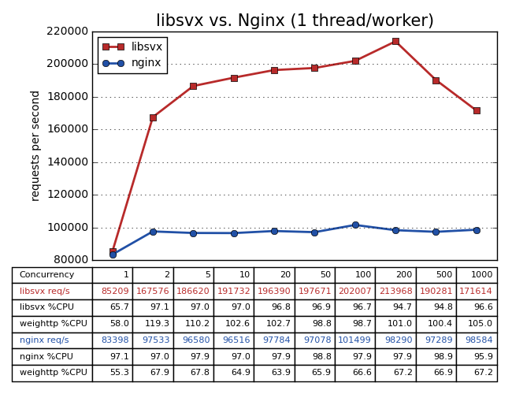

Main Page {#mainpage}
=========

Overview
--------

libsvx (service X library) is a pure C network library. It only supports
Linux, but it depend on very few libraries (only libc and libpthread).

libsvx use reactor pattern. It provides a mechanism to execute a callback
function when a specific event occurs on a file descriptor or after a
timeout has been reached. Based on this mechanism, libsvx provides the
following basic network modules: TCP server module, TCP client module,
UDP module and ICMP module. libsvx does *NOT* contain any application layer
network modules like HTTP server, HTTP client, DNS client, etc.

libsvx use the thread mode called: one I/O looper pre thread, with optional
thread pool.

Feature
-------

* supports IPv4 and IPv6
* supports epoll, poll and select
* TCP server module
* TCP client module
* UDP module (unicast and multicast)
* ICMP module (ICMPv4 and ICMPv6)
* asynchronous log module
* crash log module
* thread pool module
* process helper module (watchdog, daemon, singleton, user/group, signal, etc.)
* use BSD queue(3) and tree(3) data structure

Benchmark
---------

Here is a performance benchmark testing that libsvx vs. Nginx. We wrote a
very simple HTTP server (benchmarks/httpserver/main.c) using libsvx for test.
We use weighttp(https://github.com/lighttpd/weighttp) as the benchmarking tool,
and use matplotlib(http://matplotlib.org/) to create a image from test results.
libsvx/nginx and weighttp run in the same machine.

* Hardware: Intel Core i5-3470 @ 3.20GHz (Quad-core), 8GB RAM, 1000mbps Ethernet

* OS: Debian 8 (Linux kernel 3.16)

* libsvx version: 0.0.6

* libsvx test HTTP server start/stop:

        start: ./benchmarks/httpserver/httpserver
        stop:  ./benchmarks/httpserver/httpserver stop

* Nginx version: 1.9.6

* Nginx conf:

        ......
        worker_processes 1; #2;
        worker_rlimit_nofile 10240;
        events {
            worker_connections  10240;
        }
        http {
            ......
            keepalive_timeout  65;
            keepalive_requests 10000;
            server {
                ......
                listen 80;
                location /hello {
                    default_type text/plain;
                    return 200 'hello world!';
                }
            }
        }
        ......

* Weighttp version: 0.3

* Weighttp command:

        weighttp -k -n 100000 -c [1|2|5| ... |1000] -t [1|2] http://127.0.0.1:port/hello

* Automated test script: benchmarks/httpserver/test.py

**NOTICE:**

**The results of this benchmark test does not means libsvx have better performance than nginx.
Because of our test HTTP server is very simple, and does not achieve a complete HTTP protocol,
so we used very little CPU instruction for each HTTP requests.**

**libsvx does not do any special optimization for HTTP server usage scenario, libsvx is mainly
used to build custom protocol network programs in customized projects.**

**The purpose of this benchmark is to show that, libsvx have the ability to cope with
high-performance, concurrent network programs, and have no larger design flaws.**

Website
-------

https://gitlab.com/caikelun/libsvx

Compile
-------

* Compile using homemade scripts and Makefiles:

        Configure : ./configure
        Compile   : make [build=r|d|prof|cover|asan|tsan|lsan|usan]
        Clean     : make clean
        Clean all : make distclean

        >>> OPTIONS <<<
        build = r (default) : compile with -O3 -fvisibility=hidden, then strip
        build = d           : compile with -O0 -g3
        build = prof        : compile with -O3 -g3 -pg
        build = cover       : compile with -O0 -g3 --coverage
        build = asan        : compile with -O0 -g3 -fsanitize=address
        build = tsan        : compile with -O0 -g3 -fsanitize=thread -fPIE
        build = lsan        : compile with -O0 -g3 -fsanitize=leak
        build = usan        : compile with -O0 -g3 -fsanitize=undefined

* Or, Compile using xmake: ( learn more about xmake: https://github.com/waruqi/xmake )

        Compile   : xmake
                    xmake f -c -m r     ; xmake -r
                    xmake f -c -m d     ; xmake -r
                    xmake f -c -m prof  ; xmake -r
                    xmake f -c -m cover ; xmake -r
                    xmake f -c -m asan  ; xmake -r
                    xmake f -c -m tsan  ; xmake -r
                    xmake f -c -m lsan  ; xmake -r
                    xmake f -c -m usan  ; xmake -r
        Clean     : xmake c
        Clean all : xmake c -a

        >>> NOTICE <<<
        The current ./xmake.lua place all output files to the ./build directory.

Test
----

* Test with valgrind:

        Compile : make clean; make
        Run     : sudo ./test/test -g

* Test with gprof:

        Compile : make clean; make build=prof
        Run     : (one of the following:)
                  ./test/test -q slist
                  ./test/test -q list
                  ./test/test -q stailq
                  ./test/test -q tailq
                  ./test/test -q splaytree
                  ./test/test -q rbtree
                  ./test/test -q log
                  ./test/test -q threadpool
                  ./test/test -q notifier
                  ./test/test -q circlebuf
                  ./test/test -q PLC
                  ./test/test -q tcp
                  ./test/test -q udp
                  sudo ./test/test -q icmp
        Profile : gprof -p ./test/test ./gmon.out
                  (more gprof command ...)

* Test with gcov:

        Compile  : make clean; make build=cover
        Run      : sudo ./test/test -d
        Coverage : cd ./src; gcov ./*.c; cd ..
                   (see ./src/*.c.gcov)

* Test with asan (AddressSanitizer):

        Compile  : make clean; make build=asan
        Run      : sudo ./test/test -d

* Test with tsan (ThreadSanitizer):

        Compile  : make clean; make build=tsan
        Run      : sudo ./test/test -d

* Test with lsan (LeakSanitizer):

        Compile  : make clean; make build=lsan
        Run      : sudo ./test/test -d

* Test with usan (UndefinedBehaviorSanitizer):

        Compile  : make clean; make build=usan
        Run      : sudo ./test/test -d

Samples
-------

* benchmarks/httpserver/main.c
* test/*.c

Documents
---------

Build local documents from source code via doxygen:

        make doc

ToDo
----

* svx_crash: Dump registers value for ARM/ARM64 architecture.
* More benchmarks.
* More samples.
* More documents.

License
-------

All of the code and documentation in libsvx has been dedicated to
the public domain by the authors. Anyone is free to copy, modify,
publish, use, compile, sell, or distribute the original libsvx code,
either in source code form or as a compiled binary, for any purpose,
commercial or non-commercial, and by any means.

The BSD queue(3) and tree(3) data structure header files
(src/svx_queue.h and src/svx_tree.h) are governed by a BSD license
that can be found at the head of these files.
